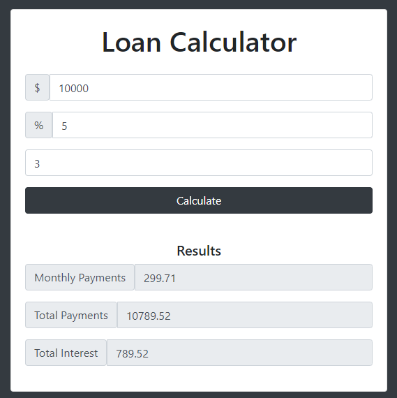

# JavaScript Loan Calculator

This is a simple loan calculator built with JavaScript that allows you to calculate the monthly payment, total payment, and total interest for a loan. You can input the loan amount, interest rate, and the number of years to repay, and the calculator will provide you with the calculated results.

## Usage

To use the loan calculator, follow the instructions below:

1. Clone or download the repository to your local machine.
2. Open the `index.html` file in a web browser.
3. Enter the loan amount, interest rate, and number of years to repay in the respective input fields.
4. Click on the "Calculate" button to generate the results.
5. The calculated monthly payment, total payment, and total interest will be displayed below the input fields.

## Example

Here's an example of how to use the loan calculator:

Loan amount: $10,000
Interest rate: 5%
Years to repay: 3

After clicking on the "Calculate" button, the following results will be displayed:

Monthly payment: $299.71
Total payment: $10,789.65
Total interest: $789.65

## Technologies Used

This loan calculator is built with the following technologies:

- HTML
- CSS
- JavaScript

## Contributing

Contributions are welcome! If you find any issues or have suggestions for improvement, please feel free to open an issue or submit a pull request.

## Acknowledgements

- The loan calculator is based on the [loan payment formula](https://en.wikipedia.org/wiki/Amortization_calculator#The_formulas) and JavaScript programming techniques.
- Thanks to all the contributors and open-source projects that helped in the development of this calculator.

## Contact

If you have any questions, suggestions, or feedback, you can reach out to the project maintainer at `GitHub Issues`.

Thank you for using the JavaScript Loan Calculator!